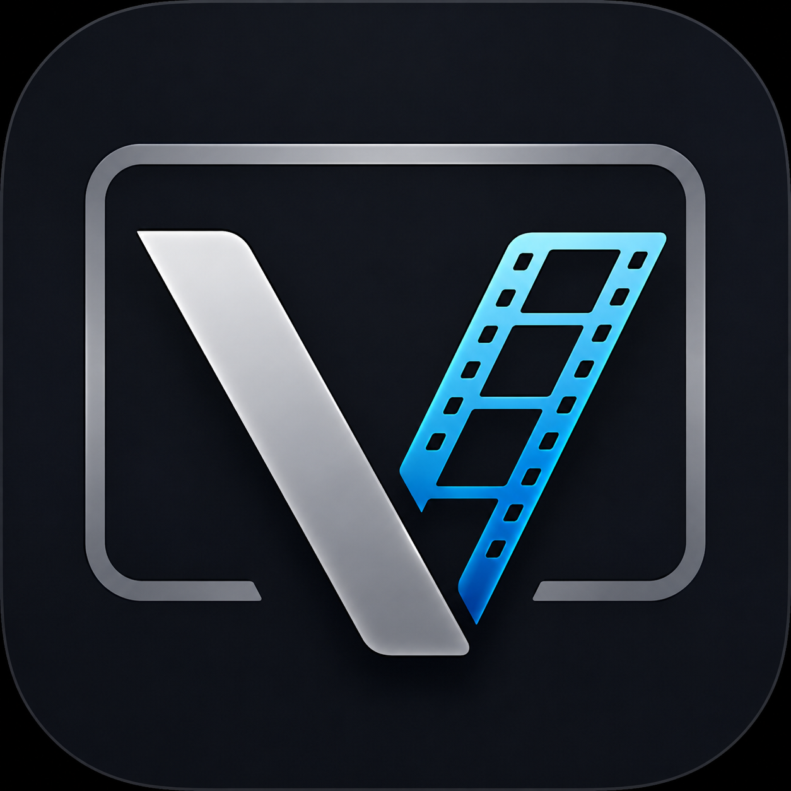

# Welcome to  Viewline Docs 

Viewline is a professional Python-based review player framework for VFX, animation, and post-production workflows. It provides accurate frame-based and time-based playback for image sequences and movie files while integrating seamlessly with production management and publishing workflows.

This project is to provide a lightweight, extensible, and production-friendly framework for media playback, image sequence review, OpenEXR workflows, and OCIO-based color management.

**Core Responsibilities**

* Review image sequences and movie files.
* Frame-accurate playback.
* Audio and video synchronization.
* Timeline navigation and scrubbing.
* Playback controls (Play, Pause, Stop, Loop, Frame Step).
* OpenColorIO (OCIO) color management. (in progress)
* Cache visualization.
* AOV (Arbitrary Output Variable) switching.
* Overlay information (frame number, resolution, FPS, metadata).
* Snapshot and annotation support.
* Pipeline integration with published versions and review notes.

The project is built primarily using 

* Python 3.10
* PySide6
* OpenGL
* OpenImageIO
* PyAV
* OCIO

This is still an early beta release focused mainly on core architecture, playback workflow, and UI foundations. There is still a lot to improve, but the project has reached a stage where I’m comfortable sharing progress publicly.

